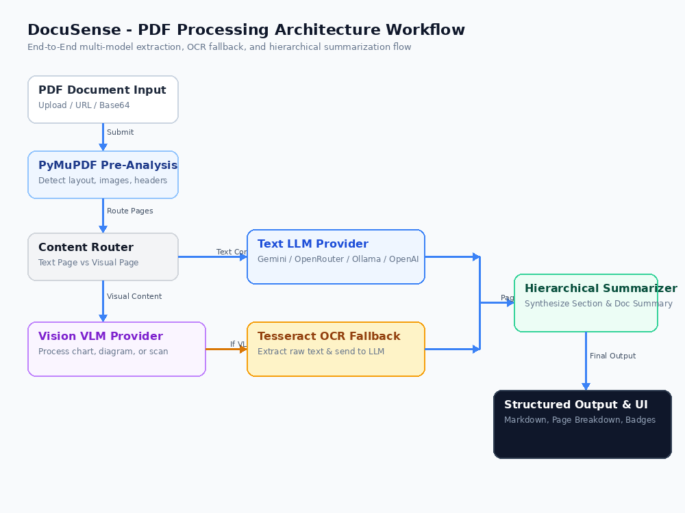
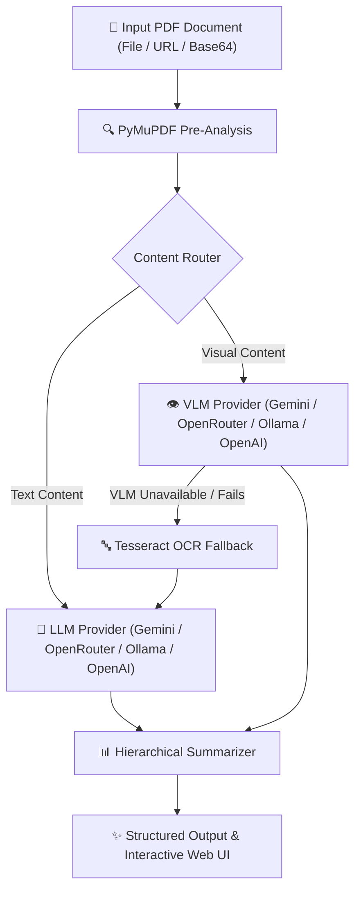
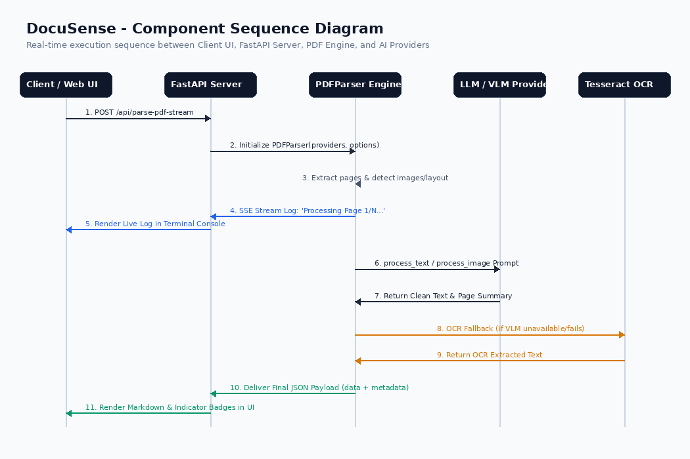
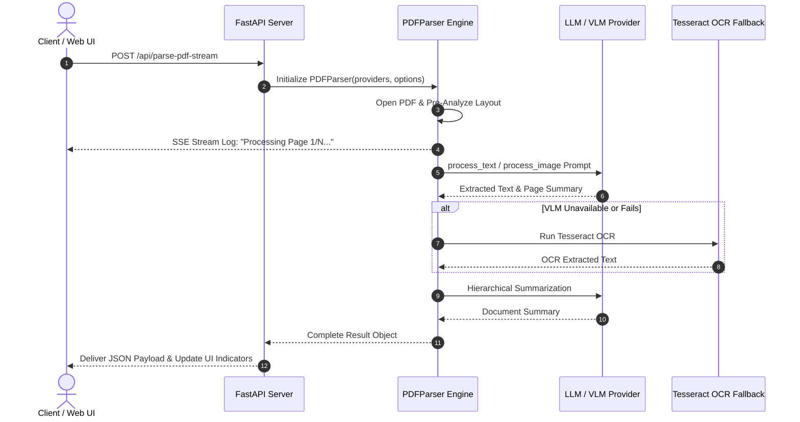

# DocuSense

DocuSense is a powerful PDF parsing and content extraction tool that leverages Large Language Models (LLMs) and Vision Language Models (VLMs) to extract, process, and summarize content from PDF documents. Whether your PDF contains text, images, or a combination of both, DocuSense provides a comprehensive solution for extracting meaningful information.

## Web App & FastAPI Server

DocuSense includes a full-featured FastAPI web app and REST API with an interactive dashboard and settings interface.

### Running the Web Server

Start the web application using `uv`:

```bash
uv run uvicorn api:app --host 0.0.0.0 --port 8000 --reload
```

Then open your browser to `http://localhost:8000`:
- **Web UI Dashboard**: `http://localhost:8000/` (Upload local PDFs or enter URLs, view Markdown rendering & page breakdowns)
- **Settings Page**: Configure API keys, base URLs, and model selections for **Google Gemini API**, **OpenRouter**, **Ollama**, **OpenAI**, and custom endpoints. Test connection live from the UI!
- **OpenAPI / Swagger Docs**: `http://localhost:8000/docs`

## Features

- **Multi-Model Provider Support**: Google Gemini API, OpenRouter, Ollama (Local AI), OpenAI, and any OpenAI-compatible API.
- **Settings Dashboard**: Enter API keys & model names per service with live connection testing.
- **Web Interface & REST API**: Interactive web dashboard with Markdown preview, page breakdowns, and REST API access.

## How It Works

DocuSense follows a structured workflow to extract, process, and summarize content from PDF documents. Below is a high-level overview of the architecture and component interactions:

#### Flow Chart


*Flow chart illustrating the overall workflow of DocuSense.*

<details>
<summary>Click to view Interactive Mermaid Flowchart</summary>



</details>

1. **PDF Parsing**: The PDF is loaded and split into individual pages using PyMuPDF (`fitz`).
2. **Layout Pre-Analysis**: Detects repeating headers/footers and scans for visual elements.
3. **Text & Vision Processing**: Text pages are processed via LLMs; image-heavy pages are described using Vision (VLMs).
4. **OCR Fallback**: If a Vision VLM is unavailable or fails, Tesseract OCR automatically extracts text from image pages.
5. **Content Summarization**: Extracted page summaries are hierarchically synthesized into an overall document summary.
6. **Output Generation**: Delivered as structured JSON and rendered in the interactive Web UI.

#### Sequence Diagram


*Sequence diagram showing the interaction between components during PDF processing.*

<details>
<summary>Click to view Interactive Mermaid Sequence Diagram</summary>



</details>

## Installation

DocuSense can be installed using either `uv` or `pip`.

### Using `uv`

If you are using `uv`, you can install the required dependencies with the following command:

```bash
uv add PyMuPDF pillow numpy pytesseract openai
```

### Using `pip`

If you are using `pip`, you can install the required dependencies with the following command:

```bash
pip install PyMuPDF pillow numpy pytesseract openai
```

## Usage

### Basic Usage

To parse a PDF document and extract its content, you can use the `parse_pdf_with_custom_providers` function:

```python
from docusense import parse_pdf_with_custom_providers

pdf_path = "sample.pdf"
output_path = "sample_output.json"

result = parse_pdf_with_custom_providers(
    pdf_path,
    llm_provider_name="openai",
    vlm_provider_name="openai",
    parallel=True,
    output_path=output_path
)

print(result)
```

### Custom Providers

You can customize the LLM and VLM providers used for text and image processing:

```python
from docusense import PDFParser, OpenAIProvider, OpenAIVisionProvider

# Initialize providers
llm_provider = OpenAIProvider(api_key="your_openai_api_key")
vlm_provider = OpenAIVisionProvider(api_key="your_openai_api_key")

# Initialize PDF parser
parser = PDFParser(
    llm_provider=llm_provider,
    vlm_provider=vlm_provider,
    chunk_size=4000,
    chunk_overlap=400,
    parallel_processing=True,
    max_workers=4,
    min_image_size=100,
    ocr_fallback=True,
    confidence_threshold=0.7,
    structure_detection=True
)

# Parse the PDF
pdf_path = "sample.pdf"
result = parser.parse_pdf(pdf_path)

print(result)
```

## Configuration

### Environment Variables

You can configure the API keys and other settings using environment variables:

- `LLM_API_KEY`: API key for the LLM provider.
- `VLM_API_KEY`: API key for the VLM provider.
- `LLM_API_BASE_URL`: Base URL for the LLM provider (if applicable).
- `VLM_API_BASE_URL`: Base URL for the VLM provider (if applicable).
- `LLM_MODEL_NAME`: Model name for the LLM provider.
- `VLM_MODEL_NAME`: Model name for the VLM provider.

### Parameters

- `chunk_size`: The size of the text chunk to be processed at a time (default: 4000).
- `chunk_overlap`: The overlap between two chunks for maintaining context (default: 400).
- `parallel_processing`: Whether to process pages in parallel (default: True).
- `max_workers`: The number of workers to use for parallel processing (default: 4).
- `min_image_size`: The minimum size of an image to be processed (default: 100 pixels).
- `ocr_fallback`: Whether to enable OCR as a fallback for image processing (default: True).
- `confidence_threshold`: The threshold for merging adjacent chunks (default: 0.7).
- `structure_detection`: Whether to enable structure detection (default: True).

## Supported Providers

### LLM Providers

- **OpenAI**: Uses GPT models for text processing.
- **OpenAI API Compatible**: Supports any model that implements the OpenAI API protocol

### VLM Providers

- **OpenAI Vision**: Uses OpenAI's vision models for image processing.
- **OpenAI API Compatible**: Supports any vision model that implements the OpenAI API protocol

## Example Output

The output of the `parse_pdf` function is a dictionary containing the extracted content, summaries, and metadata:

```json
{
  "text": "Extracted text from the document...",
  "pages": [
    {
      "page_num": 1,
      "text": "Extracted text from page 1...",
      "summary": "Summary of page 1...",
      "has_images": false,
      "confidence": 0.95
    },
    {
      "page_num": 2,
      "text": "Extracted text from page 2...",
      "summary": "Summary of page 2...",
      "has_images": true,
      "confidence": 0.9
    }
  ],
  "summary": "Hierarchical summary of the entire document...",
  "metadata": {
    "total_pages": 2,
    "contains_images": true
  }
}
```

## Contributing

Contributions are welcome! Please open an issue or submit a pull request if you have any improvements or bug fixes.

## License

DocuSense is licensed under the MIT License. See the [LICENSE](LICENSE) file for more details.

## Acknowledgements

- [PyMuPDF](https://github.com/pymupdf/PyMuPDF) for PDF parsing.
- [OpenAI](https://openai.com/) for LLM and VLM APIs.
- [Tesseract OCR](https://github.com/tesseract-ocr/tesseract) for OCR fallback.

## Contact

For any questions or support, please open an issue on the GitHub repository.

---

**DocuSense** - Your intelligent document processing companion.
